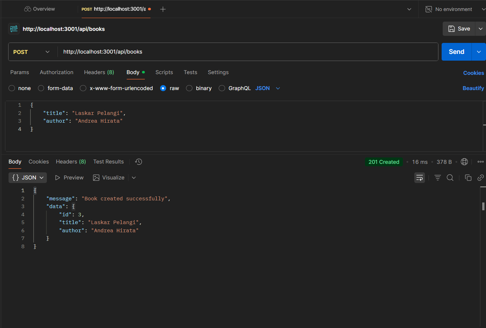
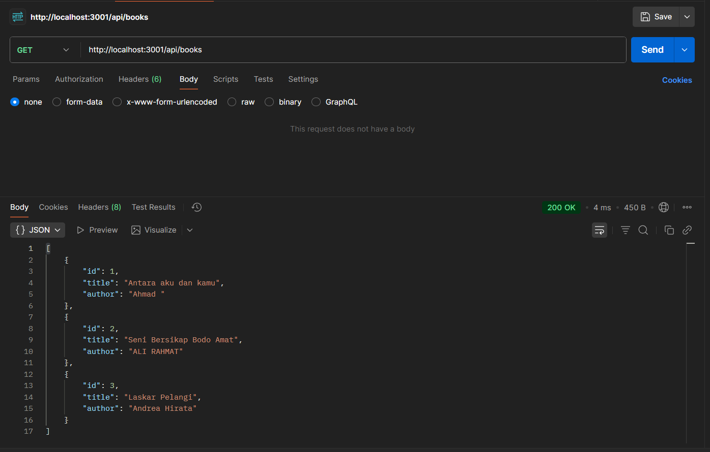
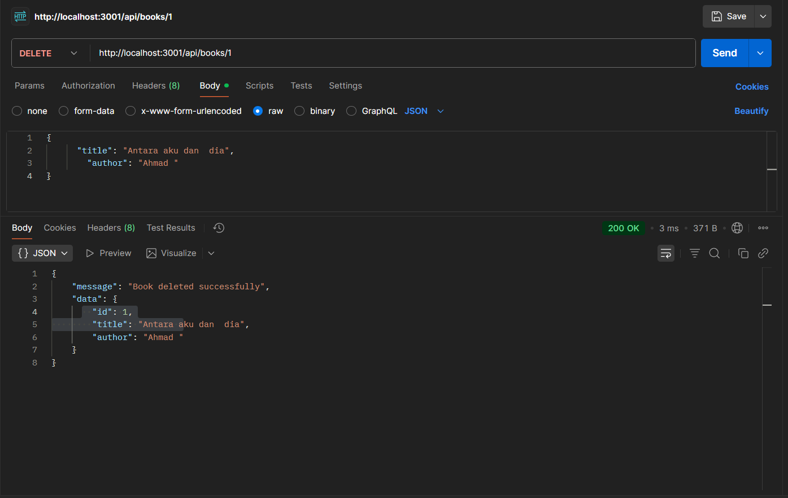

# 📘 Dokumentasi Tugas

1. **Tampilan Endpoint Create Book**  
   

2. **Tampilan Endpoint Read Book**  
   

3. **Tampilan Endpoint Update Book**  
   

4. **Tampilan Endpoint Delete Book**  
   
