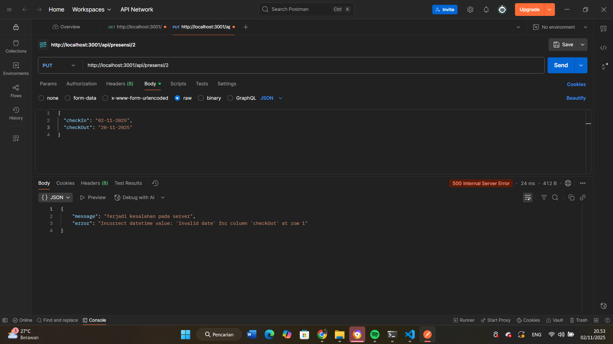
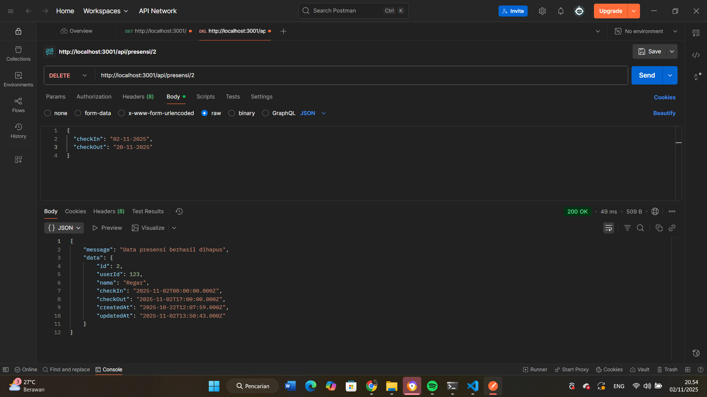
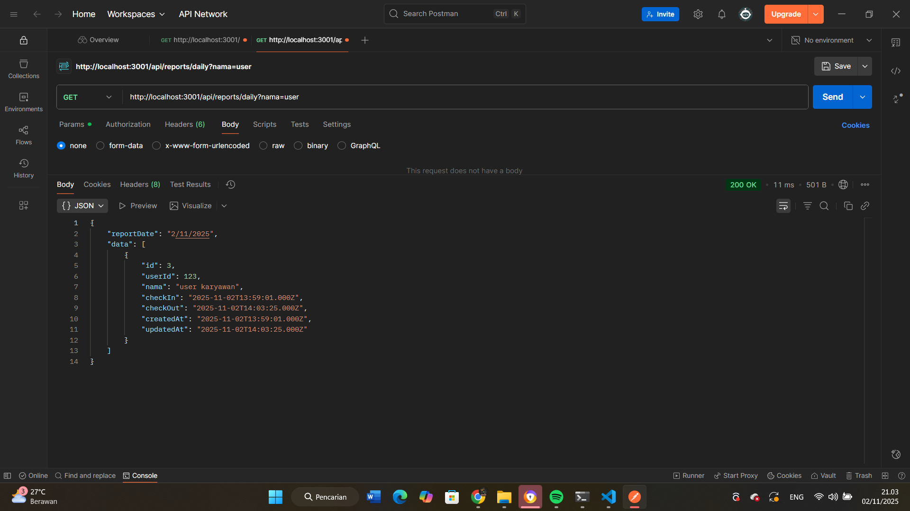
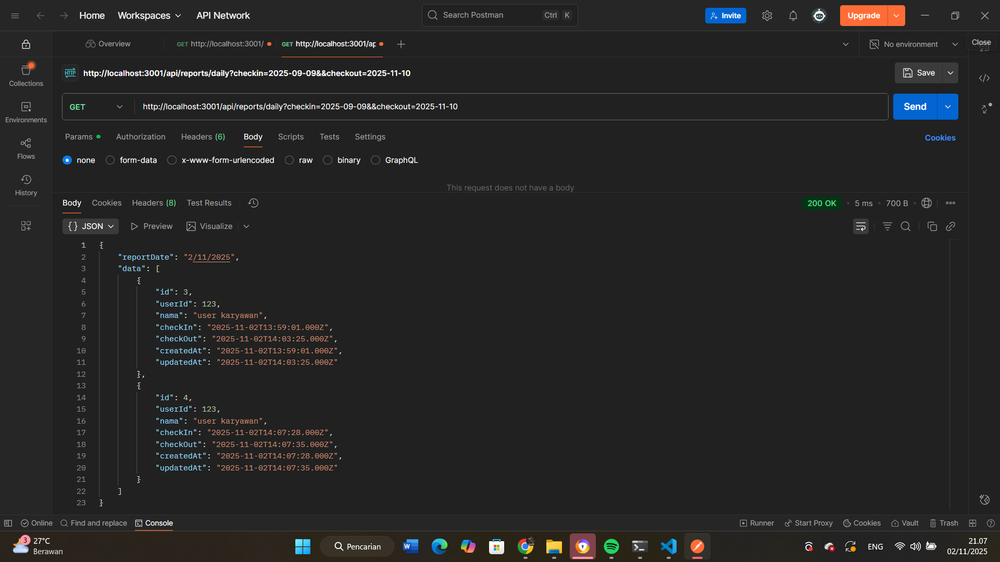

# 📘 Dokumentasi Tugas

1. **Tampilan update data presensi**  
   

2. **Tampilan Endpoint update jika format tanggal yang diisi tidak valid**  
   

3. **Tampilan Endpoint Delete Data**  
   

4. **Tampilan search berdasarkan nama**  
   

5. **Tampilan search berdasarkan tanggal**  
   
